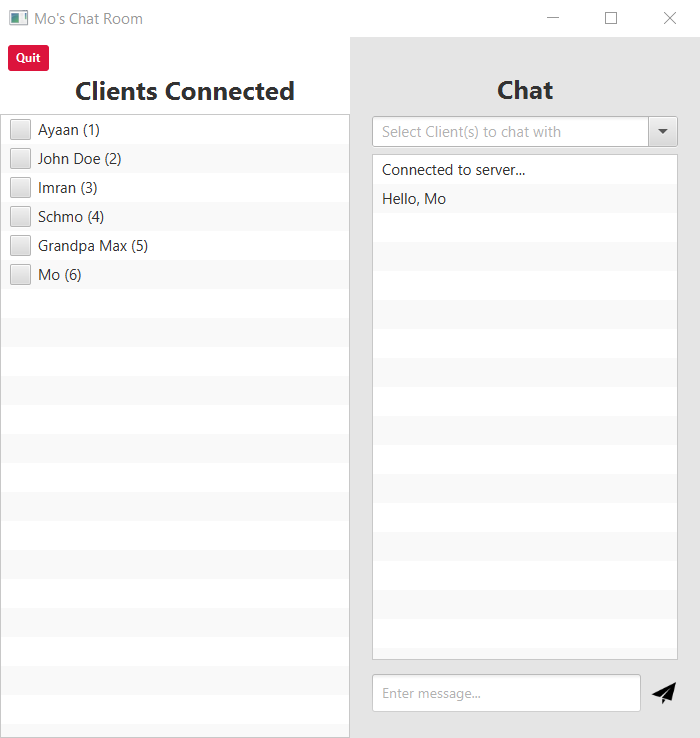

# 💬 Chat Client

Chat Client is an online chat room application written in Java. Chat Client uses JavaFx as the framework for the GUI and SceneBuilder to design pages and the overall UI. This project requires a working socket server in order to function, [N19htw1n9/Chat-Server](https://github.com/N19htw1n9/Chat-Server) provides a working socket server that Chat Client connects and establishes a TCP connection with.<br><br>

<p float="left">
    
    &nbsp;
    
</p>

The application starts by allowing the user to pick a username. Once the client selects a username and connects a TCP socket connection is established to ensure realtime exchange of chat data.

Chat provides communication with one or multiple different clients that are connected with the server, with seamless realtime communication with clients.

<p float="left">
    
    &nbsp;
    
</p>

## Usage

To ensure that the application works a working socket server must be running, since the main socket server is not yet hosted.

In order to run the socket server head over to [N19htw1n9/Chat-Server](https://github.com/N19htw1n9/Chat-Server#usage) and follow the instructions to run the server.

Once the socket server is up and running proceed to setup the client application shown below.

### Clone repo

```shell
$ git clone https://github.com/N19htw1n9/Chat-Client.git
$ cd ./Chat-Client
```

### Build project using Maven

```shell
$ mvn package
```

### Run server

```shell
$ mvn exec:java
```
